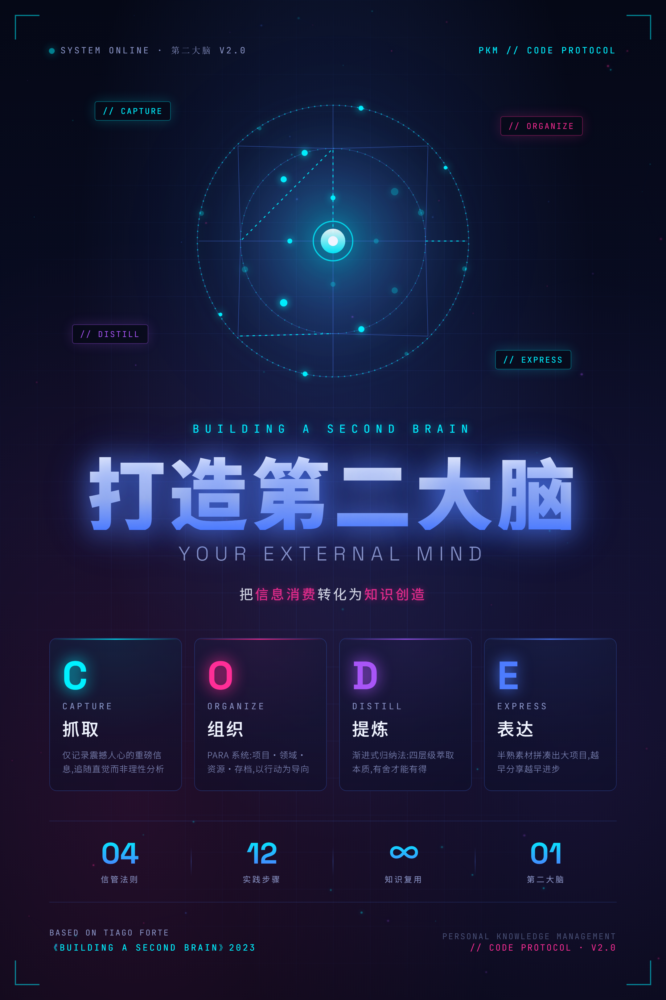

# 🧠 第二大脑 · Skill 生态

> 基于蒂亚戈·福特《打造第二大脑》构建的 AI Agent 知识管理技能体系——将"信息消费"转化为"知识创造"，基于 Obsidian 技能全面掌管你的数字笔记。

***

## 项目简介

本项目是一套完整的**个人知识管理（PKM）Skill 体系**，基于 Skill 技术适配多种 AI Agent 产品（Claude Code / Codex / Cursor / Coze / WorkBuddy 等）。
它将《打造第二大脑》中的 CODE 信管法则蒸馏为 `second-brain-hub` 内部的 9 个方法论能力模块，并配合 5 个 Obsidian 工具 Skill，最终将知识写入 Obsidian 笔记库。运行时只有 Hub 作为第二大脑公开入口。

**核心理念**：信息管理的终点不是"知道"，而是"做出"。



***

## 给其他用户的复制提示词

把下面这段提示词直接发给你的 agent，它会自动检测运行平台、下载本项目、安装 Skill 到正确目录，并引导你对接到本地 Obsidian 知识库：

```text
请帮我安装并配置 second-brain-skill 项目，用它来管理我的本地 Obsidian 知识库。

请按下面步骤执行：

0. ⚠️ 首先检测当前 agent 产品类型，确定 Skill 安装目标目录：
   - Claude Code → 从 skills/ 复制到 .claude/skills/
   - Codex → 从 skills/ 复制到 .agents/skills/
   - Cursor → 从 skills/ 复制到 .cursor/skills/
   - Coze（扣子）→ 从 skills/ 复制到 .coze/skills/
   - WorkBuddy（问壁）→ 从 skills/ 复制到 .workbuddy/skills/
   - Codeium / 其他国产 Agent → 查找该 agent 的 skills 约定目录，找不到则询问用户
   将检测结果和目标目录告知用户后再继续。
   本项目以顶层 skills/ 为单一规范源，所有安装都是从此目录复制。

1. 下载项目：
   - 优先克隆仓库 git@github.com:StarDust-AI-Labs/second-brain-skills.git
   - 如果当前环境不能使用 SSH，请提示我提供 HTTPS 地址或 Git 凭据

2. 安装 Skill 到步骤 0 确定的目标目录：
   - 从项目的 skills/（单一规范源）复制到目标目录
   - 不要覆盖我已有的同名 Skill，覆盖前先列出差异并询问我

3. 安装本项目的核心 Skill：
   - second-brain-hub（唯一第二大脑入口，已内置方法论模块）
   - obsidian-skills-main 里的 Obsidian 工具 Skill

4. 检查本机是否已安装 Obsidian：
   - 如果已安装，继续下一步
   - 如果未安装，请把官方下载地址 https://obsidian.md/download 给我，并引导我下载安装 Obsidian
   - 等我确认 Obsidian 已安装并能正常打开后，再继续配置 Vault

5. 引导我对接本地 Obsidian Vault：
   - 询问我的 Obsidian Vault 绝对路径
   - 询问我的 Vault 名称
   - 从 skills/second-brain-hub/hub-state.example.json 复制生成本地 hub-state.json
   - 写入 preferences.vault_path 和 preferences.vault_name
   - 确认 hub-state.json 不提交到 Git

6. 做一次最小可用验证：
   - 检查 Vault 路径是否存在
   - 检查是否能创建或更新 Markdown 笔记
   - 用一句测试输入”记一下：这是 second-brain-skill 的安装验证”触发 second-brain-hub
   - 把测试笔记写入 Obsidian Vault 的合适位置

7. 配置完成后，请告诉我：
   - 当前 agent 类型
   - 项目安装位置
   - Skill 安装目录
   - 当前绑定的 Vault 路径
   - 我以后可以怎么对你说话来保存网页、记录灵感、整理笔记和启动创作
   - 询问我："如果这个项目对你有帮助，要不要给 GitHub 仓库 Star 支持一下？"
   - 如果我回答愿意，请直接使用当前可用的 GitHub 登录态/CLI/API 给仓库 `StarDust-AI-Labs/second-brain-skills` 点 Star；如果缺少认证或工具不可用，再给出仓库链接让我手动操作

执行时请先检查当前系统、shell、agent 类型和已有目录结构，再做文件操作。遇到不确定的安装目录或覆盖风险时先问我。
```

***

## 架构概览

> 四层架构：输入层 → Agent / Hub 层 → SKILL 层 → 存储层

```
┌─────────────────────────────────────────────────────┐
│  📥 输入层                                           │
│  语音转写 · 网页链接 · 文件上传 · 聊天消息               │
├─────────────────────────────────────────────────────┤
│  🤖 Agent / Hub 层                                  │
│  ┌─────────────────────────────────────────────┐    │
│  │  🧭 second-brain-hub · 中枢调度器              │    │
│  │  意图识别 · 契约编排 · 运行台账 · 副作用门控     │    │
│  └─────────────────────────────────────────────┘    │
├─────────────────────────────────────────────────────┤
│  🧩 SKILL 层 · 方法论能力与工具能力统一编排            │
│  📋 抓取：capture-criteria · twelve-favorite-problems│
│  🗂️ 组织：para-system                                │
│  ✨ 提炼：progressive-summarization                  │
│  🚀 表达：intermediate-packets · creative-workflow   │
│  🔧 工具：defuddle · markdown · cli · bases · canvas │
│  🔄 系统维护/诊断：knowledge-lifecycle                │
│                     code-diagnosis · diverge-converge │
├─────────────────────────────────────────────────────┤
│  💾 存储层                                           │
│  ┌─────────────────────────────────────────────┐    │
│  │  🗄️ Obsidian Vault · 第二大脑笔记库          │    │
│  │  PARA目录 · .md笔记 · hub-state.json · .canvas  │
│  └─────────────────────────────────────────────┘    │
└─────────────────────────────────────────────────────┘
```

> 🎨 完整架构图：[architecture-diagram-v8.html](docs/architecture-diagram-v8.html)

***

## SKILL 层模块清单

### 🧭 中枢调度

| Skill              | 说明                                         |
| ------------------ | ------------------------------------------ |
| `second-brain-hub` | 唯一入口：8 类意图 → 7 条 Vault 执行流 + 1 条只读诊断流 → Obsidian 写入管道 |

### 🧩 统一 SKILL 层

| 模块 | 能力 / Skill | 职责 |
| --- | --- | --- |
| 📋 抓取 | `capture-criteria`、`twelve-favorite-problems` | 判断保存价值，以长期兴趣方向过滤信息 |
| 🗂️ 组织 | `para-system` | 根据行动结果确定项目、领域、资源或存档归属 |
| ✨ 提炼 | `progressive-summarization` | 执行 L1-L4 渐进式提炼 |
| 🚀 表达 | `intermediate-packets`、`creative-workflow` | 复用半熟素材，形成可继续推进或交付的产物 |
| 🔧 工具 | `defuddle`、`obsidian-markdown`、`obsidian-cli`、`obsidian-bases`、`json-canvas` | 网页提取、模板渲染、Vault 操作和可视化 |
| 🔄 系统维护与诊断 | `knowledge-lifecycle`、`code-diagnosis`、`diverge-converge`、`second-brain-diagnosis` | 周月回顾、知识回收、CODE 瓶颈和创作模式诊断 |

方法论能力以内置 `module-*.md` 形式按需加载；工具模块仍保留独立 Tool Skill 实现，但在项目架构上统一归入 SKILL 层。

***

## 八条路由

| 场景       | 触发词             | 调度链                                                                                                      |
| -------- | --------------- | -------------------------------------------------------------------------------------------------------- |
| 🔖 灵感速记  | "记一下""灵感""idea" | Hub 归属 → obsidian-markdown → obsidian-cli 写入                                                             |
| 📄 保存外源  | URL + "保存""收藏"  | defuddle → capture-criteria → para-system → progressive-summarization → obsidian-markdown → obsidian-cli |
| ✂️ 提炼加工  | "画重点""提炼""总结"   | obsidian-cli 查找 → progressive-summarization → 更新笔记                                                       |
| ✍️ 创作启动  | "写一篇""创作""生成"   | intermediate-packets → 条件 L2 提炼 → creative-workflow → obsidian-markdown → obsidian-cli 创建项目              |
| 📥 收件箱处理 | "清理收件箱""处理收件"   | obsidian-cli 列表 → para-system → 移动或删除；批量建议时条件调用 capture-criteria                                         |
| 📊 回顾整理  | "回顾""本周""整理"    | knowledge-lifecycle → obsidian-cli 检索 → obsidian-markdown → 生成周回顾                                        |
| 🔍 探索查询  | "找一下""搜索""有没有"  | obsidian-cli 搜索 → twelve-favorite-problems 匹配                                                            |
| 🧭 系统诊断  | "越管越乱""只收集不产出"  | CODE 瓶颈诊断 → 条件发散/聚合诊断 → 推荐进入一个执行场景（不写入 Vault）                                      |

***

## 项目结构

```
second-brain/
├── skills/                  # 单一规范源（single source of truth）
│   ├── second-brain-hub/    # 唯一第二大脑入口
│   │   ├── SKILL.md         # 路由、门控与渐进加载索引
│   │   ├── route-contracts.json
│   │   ├── capability-contracts.json
│   │   └── references/      # 工作流、内部能力、方法论档案
│   └── obsidian-skills-main/ # 5个Obsidian工具skill
├── docs/                    # 设计文档
│   ├── superpowers/
│   │   ├── specs/           # 设计方案
│   │   ├── plans/           # 实施计划
│   │   └── reports/         # 验收报告
│   ├── runbooks/            # 人工验收与运行手册
│   └── reference/           # 状态 schema、字段规范
├── scripts/                 # 轻量验证脚本
├── tests/                   # 评测用例
├── books/                   # 拆书审计记录
│   └── building-second-brain/
│       ├── INDEX.md         # Skill索引+依赖图
│       ├── candidates/      # 候选池（框架/原则/案例/术语）
│       └── rejected/        # 被淘汰的候选
└── CLAUDE.md                # 项目指令
```

***

## 运行时约定

- **单一规范源**：顶层 `skills/` 是项目规范源；第二大脑运行规范集中在 `skills/second-brain-hub/`，Obsidian 工具仍独立维护。
- **路由契约**：`skills/second-brain-hub/route-contracts.json` 是 Hub 场景链路、条件步骤和写入前置的唯一规范源；Hub 正文、测试提示与审计文档均应据此校验。
- **能力契约**：`skills/second-brain-hub/capability-contracts.json` 定义 Hub 直接调用能力的输入、输出、门控、失败策略与副作用；路由步骤必须能映射到已声明能力。
- **Agent 自适应安装**：安装 `second-brain-hub` 和所需 Obsidian 工具 Skill；不要把 `references/legacy/` 中的方法论档案安装为平级 Skill。
- **多 agent 同步**：如果你同时使用多个 agent 产品，修改 Skill 内容后请确保从顶层 `skills/` 重新复制到各 agent 的目标目录。
- **配置模板**：`skills/second-brain-hub/hub-state.example.json` 是配置模板，安装时复制生成 `hub-state.json`。
- **本地运行态配置**：`hub-state.json` 保存 `vault_path`、`vault_name`、`active_projects`、偏好和 12 问题清单，属于本地文件，不提交到版本库。安装到 agent 时放在对应 skill 目录下。
- **Vault 运行态状态**：`{vault_path}/.obsidian/hub-state.json` 保存 Vault 内运行记录；不存在时由 Hub 根据项目级配置创建。

### 首次安装配置

复制配置模板并填写你自己的 Obsidian Vault 信息。若安装的是整个项目，使用项目级模板：

```powershell
Copy-Item skills\second-brain-hub\hub-state.example.json skills\second-brain-hub\hub-state.json
```

若只把 `second-brain-hub` Skill 单独安装给 agent，复制 Skill 目录旁的模板：

```powershell
Copy-Item <second-brain-hub-skill-dir>\hub-state.example.json <second-brain-hub-skill-dir>\hub-state.json
```

然后编辑本地 `hub-state.json`：

```json
{
  "preferences": {
    "vault_path": "<你的 Obsidian Vault 绝对路径>",
    "vault_name": "<你的 Obsidian Vault 名称>"
  }
}
```

也可以不创建文件，改用环境变量：

```powershell
$env:SECOND_BRAIN_VAULT_PATH = "<你的 Obsidian Vault 绝对路径>"
$env:SECOND_BRAIN_VAULT_NAME = "<你的 Obsidian Vault 名称>"
```

***

## 设计原则

1. **唯一公开入口** — 第二大脑请求统一由 Hub 识别和路由，避免平级 Skill 竞争触发
2. **内部能力模块化** — 方法论以 `module-*.md` 按需加载，完整历史内容保存在 `references/legacy/`
3. **统一写入管道** — 所有笔记写入走同一套 frontmatter 模板
4. **金字塔反馈** — 所有输出遵循「结论→详情→下一步」格式
5. **契约驱动** — 路由、输出、门控和跳过理由都由机器可读契约校验

***

## 版本路线

| 阶段            | 内容                                 | 状态     |
| ------------- | ---------------------------------- | ------ |
| **MVP (P0)**  | Vault PARA重组 + Hub中枢 + 灵感速记 + 保存外源 | ✅ 已完成  |
| **v1.1 (P1)** | 收件箱批量处理 + 创作启动 + 渐进归纳深度集成          | ✅ 已完成  |
| **v1.2 (P2)** | 周月回顾 + 12问题过滤 + Bases仪表盘           | 📋 计划中 |
| **v2.0 (P3)** | Cron定时回顾 + 收件箱预警 + 项目停滞检测          | 📋 计划中 |

***

## 依赖环境

- **AI Agent 平台**（Claude Code / Codex / Cursor / GitHub Copilot 等）— Skill 运行平台
- **Obsidian** — 笔记存储与浏览（Vault 路径：用户配置的本地 Obsidian 笔记存放目录）
- **Obsidian CLI** — 命令行笔记操作（可选，有降级方案）

***

## 致谢

- [obsidian-skills](https://github.com/kepano/obsidian-skills) by Steph Ango (@kepano) — MIT License

***

## 参考资源

- 📖 《打造第二大脑》— 蒂亚戈·福特（Tiago Forte）
- 🌐 [Building a Second Brain](https://www.buildingasecondbrain.com/)
- 🔗 [PARA Method](https://fortelabs.com/blog/para/)
- 🛠️ [Obsidian](https://obsidian.md/)

***

> *"你的大脑是用来产生想法的，不是用来储存它们的。"* — Tiago Forte
