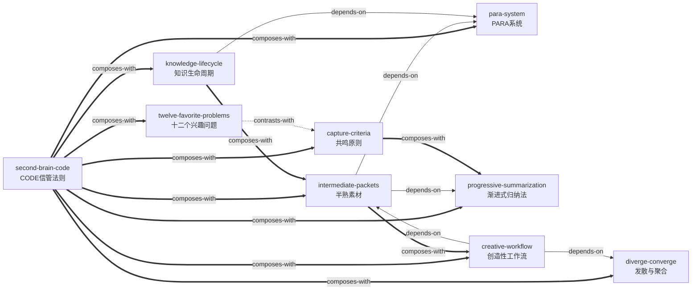

# 《打造第二大脑》 — Skill Index

> 本书由 book2skill 蒸馏, 共产出 **9** 个 skills。
> 处理时间: 2026-06-09

## 关于这本书

- **作者**: 蒂亚戈·福特 (Tiago Forte)
- **出版年**: 2023年11月 (中文版); 原版 2022年
- **一句话主旨**: 利用数字笔记工具构建"第二大脑"（外部知识管理系统），通过CODE信管法则将信息转化为创造性成果
- **整书理解**: 见 [BOOK_OVERVIEW.md](./BOOK_OVERVIEW.md)

---

## Skill 列表 (按主题分组)

### 🧭 顶层框架

- [`second-brain-code`](./second-brain-code/SKILL.md) — **CODE信管法则**：四步信息管理顶层路线图（抓取→组织→提炼→表达），串联所有其他skill
- [`diverge-converge`](./diverge-converge/SKILL.md) — **发散与聚合模式**：解释创作活动底层节律的双模式模型，帮助你识别"为什么卡住了"

### 📋 信息输入

- [`capture-criteria`](./capture-criteria/SKILL.md) — **共鸣原则与信息抓取标准**：用四项标准+直觉共鸣判断"什么值得记录"，根治数字囤积
- [`twelve-favorite-problems`](./twelve-favorite-problems/SKILL.md) — **十二个兴趣问题**：费曼式开放式问题清单，用好奇心为信息消费导航

### 🗂️ 信息组织

- [`para-system`](./para-system/SKILL.md) — **PARA组织系统**：以行动为导向的四类信息分类法（项目/领域/资源/存档），告别"文件夹地狱"
- [`progressive-summarization`](./progressive-summarization/SKILL.md) — **渐进式归纳法**：四层级笔记提炼技术，让未来的自己在30秒内理解任何一条笔记

### 🚀 创造产出

- [`intermediate-packets`](./intermediate-packets/SKILL.md) — **半熟素材思维**：将工作产出视为可复用的知识资产，永不从零开始
- [`creative-workflow`](./creative-workflow/SKILL.md) — **创造性工作流**：三项策略组合（思想群岛+海明威之桥+压缩范围）解决创作中的开始/持续/收尾困境

### 🔄 系统维护

- [`knowledge-lifecycle`](./knowledge-lifecycle/SKILL.md) — **知识生命周期管理**：项目清单+周月小结+处处留意，确保系统持续运转、知识产生复利

---

## 引用图



图例:
- `-->`  depends-on
- `-.->` contrasts-with
- `===>` composes-with

---

## 推荐学习顺序

(从依赖图的叶子节点开始, 向上)

1. **[second-brain-code](./second-brain-code/SKILL.md)** — 从顶层框架入手，理解CODE四步全流程，建立一个全局地图
2. **[capture-criteria](./capture-criteria/SKILL.md)** — 建立"什么值得记录"的判断标准，根治最常见的数字囤积问题
3. **[twelve-favorite-problems](./twelve-favorite-problems/SKILL.md)** — 用好奇心方向进一步精准你的信息筛选
4. **[para-system](./para-system/SKILL.md)** — 学会用PARA组织信息，解决"笔记放哪里"的核心痛点
5. **[progressive-summarization](./progressive-summarization/SKILL.md)** — 掌握分层提炼技巧，提升笔记的长期价值
6. **[intermediate-packets](./intermediate-packets/SKILL.md)** — 培养知识资产化思维，告别"从零开始"
7. **[diverge-converge](./diverge-converge/SKILL.md)** — 理解创作活动的底层节律，找到自己卡住的原因
8. **[creative-workflow](./creative-workflow/SKILL.md)** — 掌握三项实操策略，打通创作全流程
9. **[knowledge-lifecycle](./knowledge-lifecycle/SKILL.md)** — 建立可持续的维护习惯，让系统长久运行

---

## 接入 darwin-skill

所有 skill 均带有 `test-prompts.json` (darwin-skill 兼容格式), 可直接接入自动进化:

```
darwin evolve books/building-second-brain/
```

---

## 审计轨迹

- 候选单元池: [candidates/](./candidates/)
  - 框架提取: 21个 → [frameworks.md](./candidates/frameworks.md)
  - 原则提取: 39个 → [principles.md](./candidates/principles.md)
  - 案例提取: 30个 → [cases.md](./candidates/cases.md)
  - 反例提取: 15个 → [counter-examples.md](./candidates/counter-examples.md)
  - 术语词典: 15条 → [glossary.md](./candidates/glossary.md)
- 被淘汰的候选 (含原因): [rejected/](./rejected/)
- 三重验证通过的单元: [verified.md](./verified.md)
- BOOK_OVERVIEW: [BOOK_OVERVIEW.md](./BOOK_OVERVIEW.md)
