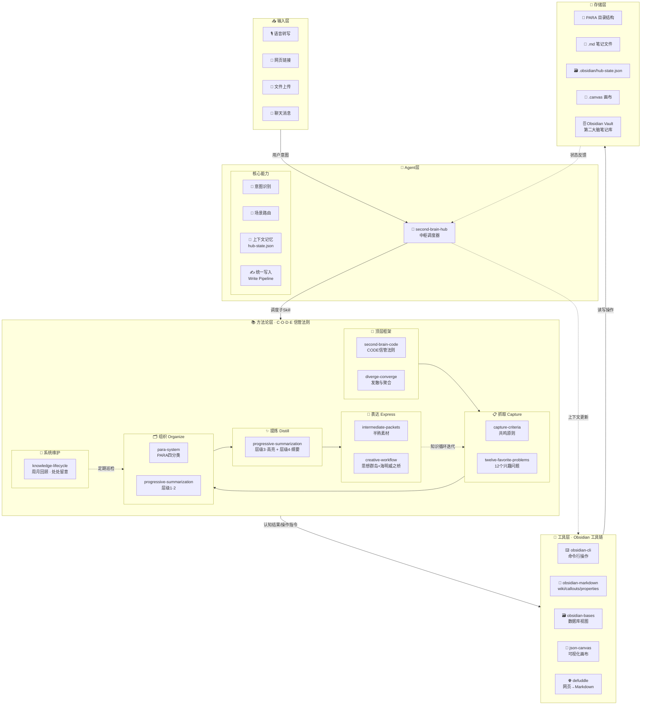

# 🧠 第二大脑 · 五层架构图 (Mermaid)

> SVG 完整版: [architecture-diagram-v8.html](architecture-diagram-v8.html)

```mermaid
graph TD
    %% ============================================================
    %% LAYER 1: 输入层
    %% ============================================================
    subgraph L1["📥 输入层"]
        direction LR
        A1["🎙️ 语音转写"]
        A2["🔗 网页链接"]
        A3["📄 文件上传"]
        A4["💬 聊天消息"]
    end

    %% ============================================================
    %% LAYER 2: Agent层
    %% ============================================================
    subgraph L2["🤖 Agent层"]
        HUB["🧭 second-brain-hub<br/>中枢调度器"]
        
        subgraph HUB_CAPS["核心能力"]
            direction LR
            H1["🎯 意图识别"]
            H2["🔀 场景路由"]
            H3["🧠 上下文记忆<br/>hub-state.json"]
            H4["✍️ 统一写入<br/>Write Pipeline"]
        end
    end

    %% ============================================================
    %% LAYER 3: 方法论层
    %% ============================================================
    subgraph L3["📚 方法论层 · C·O·D·E 信管法则"]
        subgraph FRAMEWORK["🧭 顶层框架"]
            direction LR
            F1["second-brain-code<br/>CODE信管法则"]
            F2["diverge-converge<br/>发散与聚合"]
        end

        subgraph CAPTURE["📋 抓取 Capture"]
            direction LR
            C1["capture-criteria<br/>共鸣原则"]
            C2["twelve-favorite-problems<br/>12个兴趣问题"]
        end

        subgraph ORGANIZE["🗂️ 组织 Organize"]
            direction LR
            O1["para-system<br/>PARA四分类"]
            O2["progressive-summarization<br/>层级1·2"]
        end

        subgraph DISTILL["✨ 提炼 Distill"]
            direction LR
            D1["progressive-summarization<br/>层级3·高亮 + 层级4·纲要"]
        end

        subgraph EXPRESS["🚀 表达 Express"]
            direction LR
            E1["intermediate-packets<br/>半熟素材"]
            E2["creative-workflow<br/>思想群岛+海明威之桥"]
        end

        subgraph MAINTAIN["🔄 系统维护"]
            direction LR
            M1["knowledge-lifecycle<br/>周月回顾 · 处处留意"]
        end

        FRAMEWORK --> CAPTURE
        CAPTURE --> ORGANIZE
        ORGANIZE --> DISTILL
        DISTILL --> EXPRESS
        EXPRESS -.->|知识循环迭代| CAPTURE
        MAINTAIN -.->|定期巡检| ORGANIZE
    end

    %% ============================================================
    %% LAYER 4: 工具层
    %% ============================================================
    subgraph L4["🔧 工具层 · Obsidian 工具链"]
        direction LR
        T1["⌨️ obsidian-cli<br/>命令行操作"]
        T2["📝 obsidian-markdown<br/>wiki/callouts/properties"]
        T3["🗃️ obsidian-bases<br/>数据库视图"]
        T4["🎨 json-canvas<br/>可视化画布"]
        T5["🌐 defuddle<br/>网页→Markdown"]
    end

    %% ============================================================
    %% LAYER 5: 存储层
    %% ============================================================
    subgraph L5["💾 存储层"]
        direction LR
        V1["📁 PARA 目录结构"]
        V2["📄 .md 笔记文件"]
        V3["🗃️ .obsidian/hub-state.json"]
        V4["🎨 .canvas 画布"]
        VAULT["🗄️ Obsidian Vault<br/>第二大脑笔记库"]
    end

    %% ============================================================
    %% CROSS-LAYER CONNECTIONS
    %% ============================================================
    L1 -->|用户意图| HUB
    HUB -->|调度子Skill| L3
    L3 -->|认知结果/操作指令| L4
    L4 -->|读写操作| L5
    
    L5 -.->|状态反馈| HUB
    HUB -.->|上下文更新| L4
```
